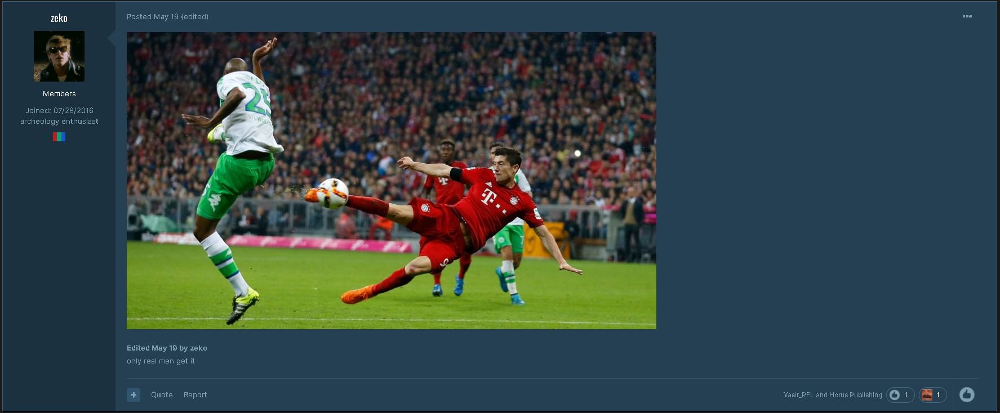
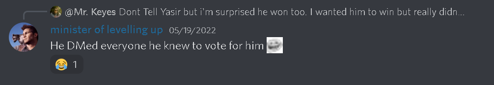
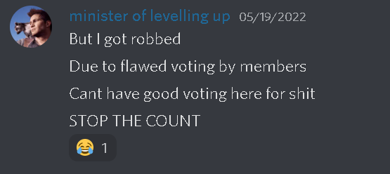
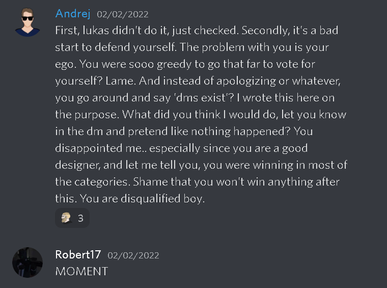
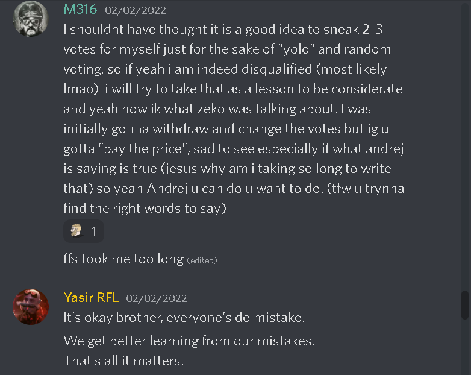
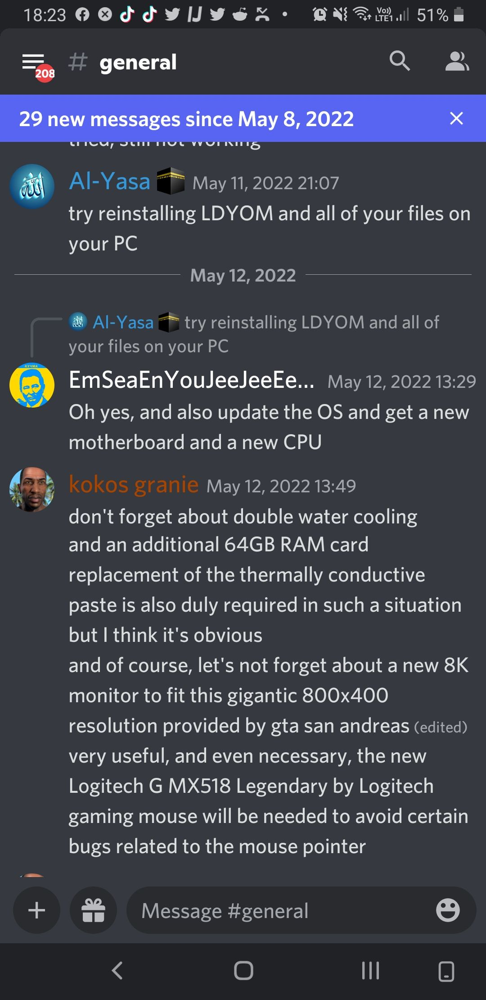

###### [:us: Translate](English.MD)

# DYOM In a Nutshell

## Contexto

"In a nutshell", em inglês, é uma expressão que traduzida ao pé da letra seria "em uma casca de nóz". O significado dessa giria é como se fosse "de maneira resumida" ou "em poucas palavras".

## Apresentação

Toda comunidade tem seus momentos únicos, suas referências e piadas internas que apenas os membros dela conseguem entender facilmente.

Nesse artigo iremos explorar todos os momentos engraçados e únicos que os membros da comunidade nos proporcionam. Desde brigas, frases memoráveis, histórias e imagens até acontecimentos marcantes para a comunidade DYOM.

Vale lembrar que esta lista está em constante desenvolvimento e iremos atualizá-la sempre que surgir um acontecimento novo ou algo que deixamos passar. Você pode contribuir para o crescimento desta lista postando aqui: [LINK]()

## A Lista

  
Yasir roubou Zeko

  
  Quando foi anunciado os votos para o [DYOM Contest #10](https://gtaforums.com/topic/982670-design-your-own-mission-contest-10-winner/), Zeko teve a surpreendente notícia de que sua missão, [Propane Nightmres](https://dyom.gtagames.nl/show/71974), perdeu para a missão de Yasir_RFL, [Melancholic Farm and Services](https://dyom.gtagames.nl/show/71976).

Yasir resumiu o concurso em um vídeo curto:

[yasir_meme](images/yasir_meme.mp4)

During Mission of te Week #201 (MOTW #201), Toriality made a mission called [The Cowbastards](https://dyom.gtagames.nl/show/72135), where he makes a sattire of the situation. There's the transcript of the first scene of the mission:

> **_GUY 1_**: Hey man, let's play a mission i made in DYOM?  **_GUY 2:_** Oh cool, what's the theme?  **_GUY 1:_** Mercenaries!  **_GUY 2:_** Pfft, shitty theme...  **_GUY 1:_** What? Where are you going?  **_GUY 2:_** I'm going to play Katabasis  **_GUY 1:_** Katabasis? Wasn't it made by that guy who losts DYOM Contest 10?  **_GUY 2:_** Zeko didn't lost! He was robbed by Yasir! R O B B E D  **_GUY 1:_** Yeah, sure. Good luck.

---

 
M316 desqualificado

 
 Durante o [DYOM Awards 2021](https://gtaforums.com/topic/980461-dyom-awards-2021-winners/), foi descoberto pelo moderador Andrej que o M316 &mdash; que concorria em mais de 6 categorias &mdash; votou em si próprio em três categorias. Porém, devido suas contribuições no ano de 2021, foi feita uma única exceção, permitindo com que ele possa participar da categoria "Most Promising MP/SL" (MP/SL Mais Promissora).

A missão [The Cowbastards](https://dyom.gtagames.nl/show/72135), de Toriality, também faz sátira da disqualificação do M316. Nessa missão um grupo de mercenários é contratado para um trabalho específico, um dos personagens pergunta por quê o contratante escolheu um grupo de mercénarios para um trabalho tão simples sendo que ele poderia contratar um hitman, no caso, o agente M316. A protagonista responde que o contratante entrou em contato com a empresa do agente M316 porém foi notificado que ele havia sido disqualificado por motivos desconhecidos.

---

 
Prints do Discord

Sessão reservadas para prints engraçadas retiradas no [nosso servidor do Discord](https://discord.com/invite/XzqxyV7) ou em outros servidores.

 

  
How to fix LDYOM

 

---

 
Missões fora de contexto

Sessão reservada para prints de missões DYOM com erros gramaticais engraçados ou de gosto duvidoso em modo geral

---

 
DYOM Speedruns

[Joshimuz](https://www.youtube.com/c/Joshimuz) é um streamer da Twitch e YouTuber conhecido pelo seus speedruns, particularmente os speedruns de GTA San Andreas. No dia 18 de Maio de 2022 ele fez o primeiro speedrun de missões do DYOM. Abaixo está a lista completa de todos os speedruns DYOM feito por ele até o momento:

- May 18, 2022 - [Speedrunning YOUR Missions! | First ever Random DYOM Speedrun Challenge](https://www.youtube.com/watch?v=GJKr7uR6Wy0)
- May 19, 2022 - [Random DYOM Speedrun Test Stream](https://www.youtube.com/watch?v=XR4WdNs7X-o)
- May 26, 2022 - ["POPPING SOUND" | Random DYOM Couch Coop Speedrun Challenge](https://www.youtube.com/watch?v=D5wKzcmMsqA&t=10848s)
- June 1, 2022 - [[REDACTED] vs [REDACTED] | Random DYOM Speedrun Challenge](https://www.youtube.com/watch?v=PCkhASPI-aA)
- June 5, 2022 - ["UCCIDI BIG SMOOKE !!" | Random DYOM Speedrun Challenge](https://www.youtube.com/watch?v=paFpb3ksmd4)
- June 10, 2022 - ["cj que hacem0s aqui" | Random DYOM Speedrun Challenge](https://www.youtube.com/watch?v=whXCh2f-5Nw)
- June 14, 2022 - ["go kill teabone" | Random DYOM Speedrun Challenge](https://www.youtube.com/watch?v=MaWomwvW8UM)
- June 18, 2022 - ["Groove Street OG!" | Random DYOM Speedrun Challenge](https://www.youtube.com/watch?v=NI6Y-C5a3Ig&t=2058s)

---

 
Raxo's comeback

A missão enviada para o MOTW 203, "Raxo's Comeback", competiu entre 10 outras missões e conseguiu ganhar com votação recorde na comunidade DYOM.

Considerada por muitos uma das missões mais memoráveis e únicas devido ao seu humor e uso de add-ons criados únicamente pelo autor para a missão, Raxo's Comeback traz uma experiência jamais vista em outras missões e ainda conta com muitas refêrencias engraçadas sobre os membros da comunidade.

Você pode conferir a gameplay da missão abaixo, feita pelo YouTuber GTA RACOON.

[[MOTW #203] RAXO'S COMEBACK - DYOM WALKTROUGH"](https://www.youtube.com/watch?v=tCFnljIdiqw&t=32s)

Ou, baixe a missão clicando no link abaixo:

[Download Raxo's Comeback](https://dyom.gtagames.nl/show/72255)

---
