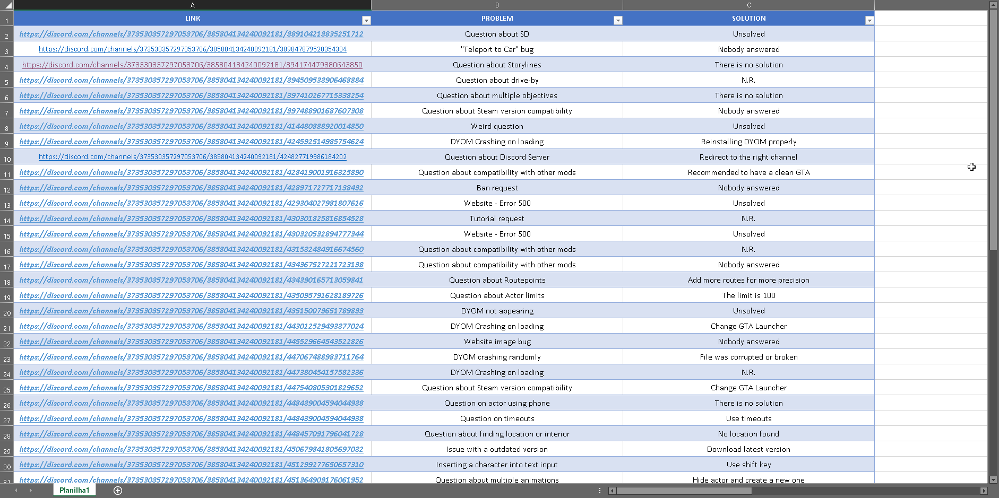
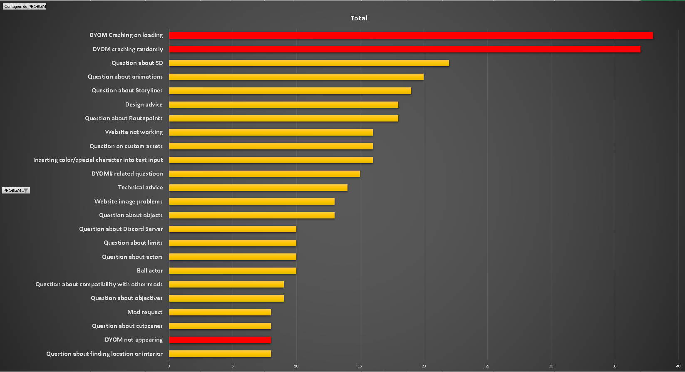

###### [:brazil: Traduzir](Portuguese.MD)

# A review of the #Support channel

## What is #Support?

> "Hi, I'm new here, I think the answer is probably no, but would there be any way to make the actor walk, stop and then walk again?"

That was the first question I asked on #support, a DYOM server channel &mdash; if you are curious what the answer to the above question is, no, it is not possible.

If you don't know already, DYOM has its own Discord server. There the community members chat about various topics, including the mod, and there is also a channel for questions called #support. If you want to join this server, [click here](https://discordapp.com/invite/XzqxyV7)

In this article, we will take a deep look at the posts within the support channel and try to answer the following question:

> **What is the most common problem encountered in DYOM?**

Is it the random crashes caused by poor mod installation? The infamous Ball Actor bug? Questions about routepoints? You will find out soon enough.

## What is the most common problem?

To answer this question, I needed to collect some data from the server. So I created a new spreadsheet in Excel, and made a table. For each row I inserted the link to the question, the problem the user was reporting, and its solution (if any)

The final result was a table with **approximately 500 entries**, check it out:

It is important to mention that the total number of 500 entries collected is far from the total number of questions asked in the #support channel. Collecting literally all the questions would be a very time-consuming and overwhelming task. I think 500 entries are enough to have a realistic analysis of the data.

## The final result

After almost a week of inserting new entries into the table, I finally reached a comfortable number of entries so that we can graphically analyze the data.

Here is the graph:

As we can see from the graph above, the vast majority of users have a hard time getting DYOM to work properly.

One of the main solutions to both the **DYOM Crashing on Loading** and **DYOM Crashing Randomly** problems are:

- Install **CLEO 4**
- Get the **1.0 GTA_SA.exe** version
- Install DYOM into the **correct folder** (GTA San Andreas User Files)

I have also noticed that sometimes **the same user has the above problem more than once**, because they have formatted their computer or purchased another version of GTA SA.

Pay attention to the red colors in the graph. Besides the first two problems that stand out, also in red is **DYOM Not Appearing**, because this problem, even though it is not very commonly reported in the Support channel, its solution is the same as the first two problems. It occurs when the user clicks on "New Game" and does not have the option to start "Design Your Own Mission".

Given this, we must think of a solution to these occurring problems. A system that frustrates the user right from the start, without even trying out its functions, is a bad system[^install].

We do have helpful members on our server, and in about 85% of the cases[^excel], the user receives help or an answer to their problem. However, certainly many of the people who downloaded DYOM and had this problem did not even know that the Discord server existed, and probably **abandoned the modification after not being successful with the installation.**

How can we change this?

## The DYOM installer

After analyzing the graph, a question arose. How could we solve this recurring problem that occurs during the installation of DYOM?

My solution was: **an automated installer**.
