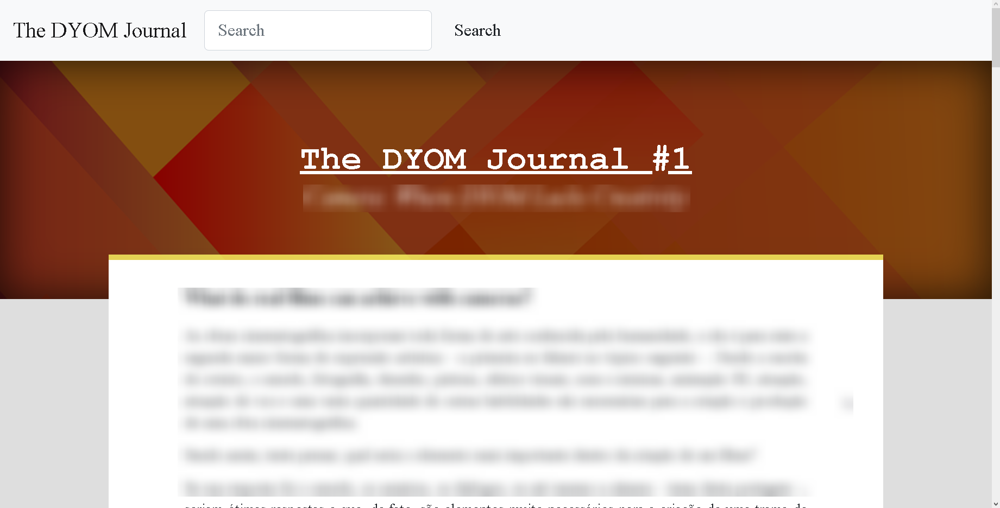

###### [:brazil: Traduzir](Portuguese.MD)

# The DYOM Journal

## The beginning

On March 27, 2022, I had just finished making my first two pages for my Information Systems college thesis.

It was a cloudy day. It was quiet and a bit boring, just like every Sunday. I had reserved my whole afternoon to do the first pages of the thesis, but I finished it early, in only two hours, so I had the whole rest of the afternoon free.

It was after buying a chocolate bar at the pharmacy that an idea came to me: "What if I wrote an article about camera positioning and posted it on the DYOM forum?" This idea comes up most likely because I had watched several videos on cinematography last night.

And while I was writing and doing my research for the article, I came across DYOM IX version 3.1, one of my favorite since it added the Zoom feature and cutscene camera lens adjustment. I started writing about Darkmorgan's disappearance and the hiatus that DYOM IX development was on at the time, and then I thought, "OK, maybe I'm straying a bit from the main topic..."

And soon after I came across a survey about what people consider as art and what they don't. The result of the survey was interesting and I started to write a little bit about it in the same text file and, I thought, "Now I'm definitely losing the focus".

But that didn't discourage me from writing the article, what happened was that I thought that instead of writing just one, maybe I could do it weekly, and then create a journal with news about the DYOM community, quest reviews, and other things that I can think of.

## thedyomjournal.com

For a few months I tried to decide what would be the best way to distribute such content. My first idea was to make the texts in Microsoft Word and when ready, paste them into GTAForums. But text formatting in Word is a bit tedious and I would probably have to make several style adjustments before posting. It was then that I came up with the idea of creating my own website for the newspaper.

Still, it was not 100% what I wanted. Maintaining a website and being the developer, administrator and writer of articles all at the same time would not work, and one day or another I would give up on the project.

At the moment, the most practical alternative I have is to write the articles in .MD (Markdown) &mdash; language very close to HTML &mdash; revise and store them on GitHub and finally, when ready, post them on the forum.

## The content

During all this time I didn't know exactly how the format and content of the articles would be, or better yet, even today I don't know very well. I can say that I have many articles already written, ready to be revised and then posted. It is uncertain, however, the main purpose of this journal, because sometimes it is an almost journalistic work with robust data and sources, sometimes it is a short article to interact with the community, or sometimes I write just to vent and say what comes to mind.

Well...

Perhaps uncertainty and unpredictability is the essence of this journal.

## Final words

Thank you very much for reading this far. I hope this project can bring a little entertainment and information to you.

This thread will always be open for article suggestions and also criticism and feedback on posted articles.

**So, what did you think of this article? What would you like to see next week?**
