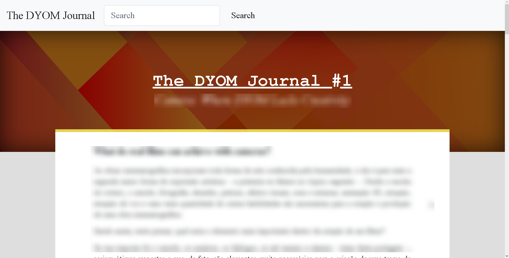

###### [:us: Translate](English.MD)

# The DYOM Journal

## O início

No dia 27 de Março de 2022, eu tinha acabado de fazer as minhas primeiras duas páginas para o TCC da minha faculdade de Sistemas de Informação.

Era um dia nublado. Estava calmo e um pouco entediante, assim como todos os domingos. Eu havia reservado a minha tarde inteira para fazer as primeiras páginas do TCC, mas acabei terminando-as cedo, em apenas duas horas, então fiquei com todo o resto da tarde livre.

Foi após comprar uma barra de chocolate na farmácia que surgiu-me uma ideia: "E se eu escrevesse um artigo sobre posiconamento de câmeras e postasse no fórum do DYOM?". Essa ideia surge muito provavelmente porque eu havia assistido vários vídeos sobre cinematografia na noite passada.

E enquanto eu escrevia e realizava minhas pesquisas para o artigo, acabei me deparando com a versão 3.1 do DYOM IX, uma das minhas favoritas pois adicionava o recurso de Zoom e ajuste da lente da câmera das cutscenes. Comecei a escreer sobre o sumiço do Darkmorgan e o hiatus que o desenvolvimento do DYOM IX se encontrava na época, e depois pensei: "OK, talvez eu esteja desviando um pouco do tema principal..."

E logo depois me deparei com uma pesquisa sobre o que as pessoas consideram como arte e o que elas não consideram. O resultado da pesquisa foi interessante e comecei a escreveer um pouco sobre isso no mesmo arquivo de texto e, pensei: "Agora eu definitivamente estou perdendo o foco.".

Mas isso não me desanimou de escrever o artigo, o que aconteceu foi que eu pensei que ao invés de escrever apenas um, eu talvez pudesse fazer isso semanalmente, e então, criar um jornal com notícias sobre a comunidade DYOM, reviews de missões, e outras coisas que me der na telha.

## thedyomjournal.com

Por alguns meses eu tentei decidir qual seria a melhor forma de distribuir este conteúdo. A minha primeira idéia foi fazer os textos no Microsoft Word e, quando prontos, colá-los no GTAForums. Porém, formatação de texto no Word é um pouco entediante e provavlemente eu teria que fazer várias adaptações no estilo antes de postar. Foi então que surgiu a ideia de criar um website próprio para o jornal.

Ainda assim, não era 100% o que eu queria. Manter um site no ar e ser o desenvolvedor, administrador e escritor dos artigos, tudo ao mesmo tempo, não iria funcionar, e uma hora ou outra eu desistiria do projeto.

No momento, a alternativa mais prática que tenho é a de escrever os artigos em .MD (Markdown) &mdash; lingaugem muito próxima ao HTML &mdash;, revisá-los e armazená-los no GitHub e finalmente, quando prontos, postá-los no fórum.

## O conteúdo

Durante todo esse tempo eu não soube exatamente como seria o formato e o conteúdo dos artigos, ou melhor, até hoje eu não sei muito bem. Posso dizer que tenho muitos artigos já escritos guardados, prontos para serem revisados e, então, postados. É incerto, porém, o principal propósito deste jornal, pois, as vezes é um trabalho quase jornalistico com dados e fontes robustas, as vezes é um pequeno artigo para interagir com a comunidade, ou as vezes escrevo apenas para desabafar e dizer que o vêm a mente,

Talvez a incerteza e imprevisibilidade seja a essência deste jornal.

## Palavras finais

Muito obrigado por ter lido até aqui. Espero que este projeto possa trazer um pouco de entretenimento e informação para vocês.

Este tópico estará sempre abertos para sugestões de artigos e também críticas e feedbacks sobre artigos postados.

E, então, o que você achou deste artigo? O que você gostaria de ver na próxima semana?
