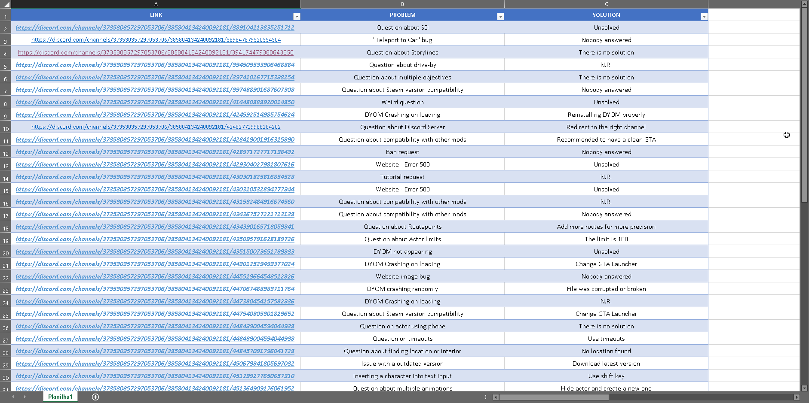
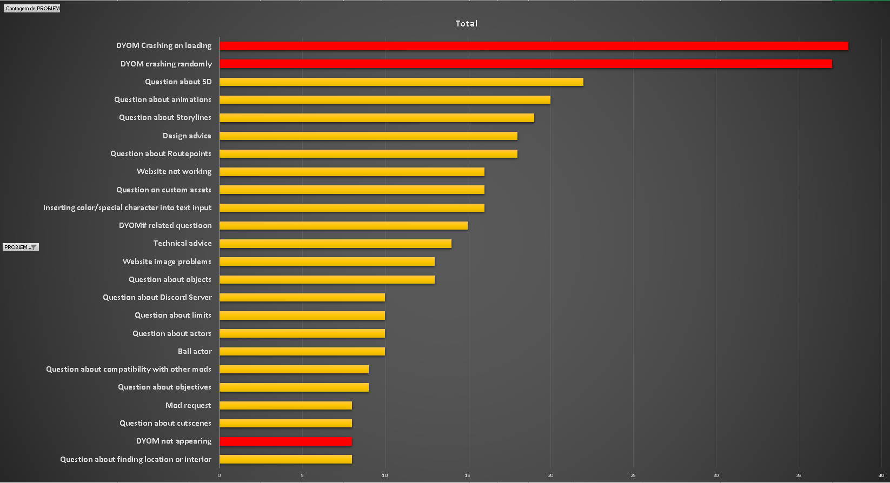

###### [:us: Translate](English.MD)

# Uma análise do canal #Support

## O que é o #Support?

> "Oi, eu sou novo aqui, eu acho que a resposta provaelmente é não, mas teria alguma maneira de fazer o ator andar, parar e depois andar novamente?"

Essa foi a primeira pergunta que eu fiz no #support, um canal do servidor do DYOM &mdash; se você estiver curioso sobre qual a resposta da pergunta acima, não, não é possível.

Se você ainda não sabe, o DYOM tem seu próprio servidor do Discord. Lá, os membros da comunidade conversam sobre diversos assuntos, incluindo o mod, e também há um canal para tirar dúvidas, chamado #support. Caso queira participar deste servidor, [clique aqui](https://discordapp.com/invite/XzqxyV7)

Neste artigo, nós iremos fazer uma profunda análise nas postagens dentro do canal de suporte e tentaremos responder à seguinte dúvida:

> **Qual é o maior problema mais comúm encontrado no DYOM?**

Será que são os crashes aleatórios causados devido a má instalação do mod? O infame Ball Actor bug? Dúvdas sobre routepoints? Você irá descobrir em breve.

## Qual é o problema mais comúm?

Para responder à essa pergunta, precisei coletar alguns dados do servidor. Então, criei uma nova planilha no Excel, e fiz uma tabela. A cada linha, eu inseria o link para a pergunta, o problema que o usuário estava reportando, e sua respectiva solução (caso existir)

O resultado final foi uma tabela com **aproximadamente 500 entradas**, confira:

É importante citar que o número total de 500 entradas coletadas está longe de ser o número total de perguntas feitas no canal #support. Coletar literalmente todas as perguntas iria ser uma tarefa massante e que exigiria muito tempo. Acho que 500 entradas são o suficiente para termos uma análise realista dos dados.

## O resultado final

Após quase uma semana inserindo novas entradas na tabela, finalmente cheguei a um núemro confortável de entradas para que possamos analisar graficamente os dados.

Eis o gráfico:

Como podemos observar no gráfico acima, a grande maioria dos usuários tem uma grande dificuldade de fazer com que o DYOM funcione adequadamente.

Uma das principais soluções para ambos os problemas **DYOM Crashing on Loading** (DYOM parando de funcionar durante o carregamento do jogo) e **DYOM Crashing Randomly** (DYOM parando de funcionar aleatoriamente) são:

- Instalar **CLEO 4**
- Obter a versão **1.0 do GTA_SA.exe**
- Instalar DYOM na **pasta correta** (GTA San Andreas User Files)

Observei também que as vezes **o mesmo usuário tem o problema citado acima por mais de uma vez**, por ter formatado o computador ou adquirido uma outra versão do GTA SA.

Atente-se às cores em vermelho do gráfico. Além dos dois primeiros problemas que se destacam, também está em vermelho **DYOM Not Appearing** (DYOM não aparecendo), pois este problema, mesmo que não sendo muito comumente reportado no canal de Suporte, a sua solução é a mesma dos dois primeiros problemas. Ele ocorre quando o usuário clica em "Novo jogo" e não tem a opção de iniciar "Design Your Own Mission"

Diante disso, devemos pensar em uma solução para estes problemas ocorrentes. Um sistema que frustra o usuário logo de início, sem antes mesmo de experimentar suas funções, é um sistema ruim[^install].

Fezlimente, temos membros prestativos em nosso servidor e, em aproximadamente 85% dos casos[^excel], o usuário recebe uma ajuda ou resposta para seu problema. No entanto, certamente muitas das pessoas que baixxaram DYOM e tiveram este problema nem sequer sabiam da existência do servidor do Discord, e provavelmente **abandonaram a modificação após não terem sucesso com a instalação.**

Como podemos mudar isso?

## O instalador DYOM

Após ter analisado o gráfico, um questionamento surgiu, como poderiamos solucionar esse recorrente problema que ocorre durante a instalação do DYOM?

Minha solução foi: **um instalador automatizado**.

Ao utilizar o DYOM Installer, o programa automaticamente detecta o diretório do seu GTA San Andreas e instala os arquivos necessários para rodar a modificação.

O instalador também conta com a opção de instalar os mais populares add-ons feitos pelos membros da comunidade.

### Features

- Apenas um arquivo .EXE
- Detecta automaticamente a sua pasta de instalação GTA San Andreas
- Instala automaticamente os ficheiros e dependências necessárias do DYOM
- Substitui automaticamente o seu EXE para 1.0v
- Detecta se o seu GTA é versão Steam ou não, fazendo as alterações necessárias
- Opção para escolher que addons deseja instalar

### Lista de Add-Ons

- SIZZZ's Add-ons
  - DYOM#
  - Machine gun
  - Darkness effect
  - Working dynamites
  - Road spikes
  - Disable teleport health regeneration
  - CCTV cameras
  - Talking on phone animation
  - Weapon shops
- Axoez/Raxo's Add-ons
  - Select time in milliseconds
  - Skip phonecalls
- Kumamon's Add-ons
  - SAMP objects

## Considerações finais

Sabemos que é muito incomum uma modificação ter um instalador e por muitas vezes suspeitamos de arquivos .EXE, porém, a proposta de termos um instalador não tem o intuito de subistituir a instalação manual. Acredito que o ideal seria termos ambas as opções.

O instalador DYOM tem seu .EXE enviado à analise de malware da Microsoft a cada atualização que o mesmo recebe, para evitar falso-positivos de Antivirus e mensagens de alerta do SmartScreen.

Caso você tenha uma sugestão ou queira reportar um problema, sinta-se livre para fazê-lo. Estarei constantemente fazendo melhorias e updates no software.

Por fim, deixo meus agradecimentos ao RithRake24 e Andrej por terem abraçado a ideia e testado o software durante o seu desenvolvimento.

[^install]: 10 THINGS THAT MAKE SOFTWARE USER-FRIENDLY. By: TECHREPUBLIC. In: https://www.techrepublic.com/article/10-things-that-make-software-user-friendly/. Accessed in: May 16, 2022.
[^excel]: EXCEL SHEET FOR #SUPPORT CHANNEL ANALYSIS. By TORIALITY. In: (download).
